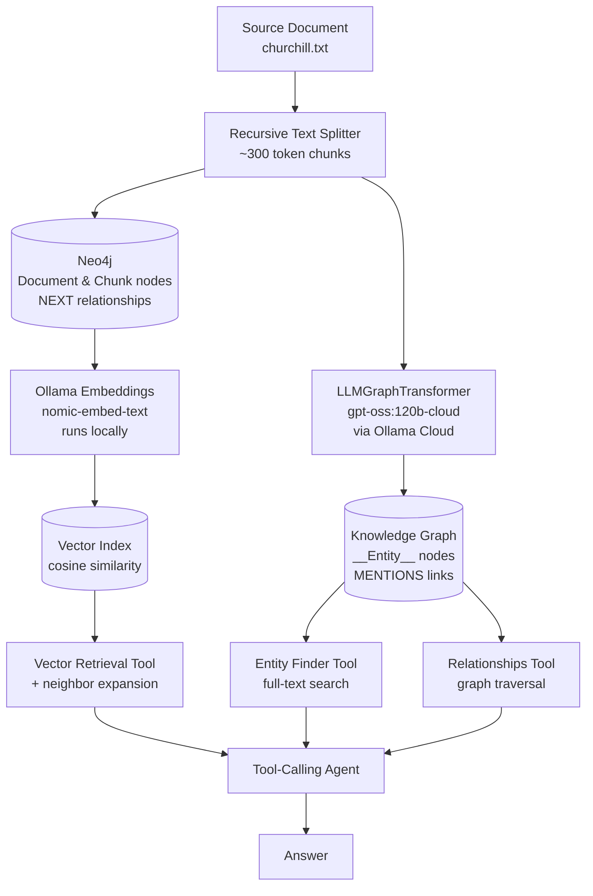
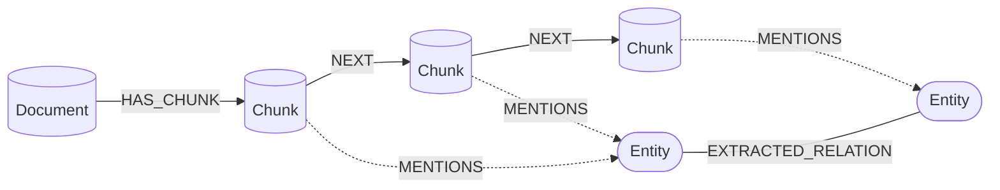

# GraphRAG Builder

A complete, hands-on implementation of **GraphRAG** (Graph-based Retrieval-Augmented Generation) built on **Neo4j**, **Ollama**, and **LangChain** — demonstrating how combining a knowledge graph with vector search significantly outperforms plain vector-only RAG.

## 📖 Overview

Traditional RAG pipelines rely solely on vector similarity search over text chunks. While effective for semantic lookup, this approach struggles with questions that require **multi-hop reasoning** or understanding **relationships between entities** (e.g., *"Which companies did the founder of X work at before starting it?"* — the answer requires connecting a person to organizations across different parts of the text, not just finding a similar passage).

This project implements a full GraphRAG pipeline that addresses this by:

1. **Chunking** a source document and storing it in Neo4j as a connected graph (`Document → Chunk → Chunk`).
2. **Embedding** chunks and creating a vector index for semantic retrieval.
3. **Extracting entities and relationships** from the text using an LLM, and linking them back to their source chunks (`Chunk -[:MENTIONS]-> Entity`).
4. **Exposing hybrid retrieval tools** — vector search with neighbor expansion, entity resolution via full-text search, and graph relationship traversal.
5. **Orchestrating everything with an LLM agent** that intelligently routes each question to the right retrieval strategy.

## 🏗️ Architecture



## 🧩 Graph Schema

The pipeline models the document, its chunks, and the extracted knowledge in a single Neo4j graph:



### Node Types

| Node | Label | Description | Key Properties |
|---|---|---|---|
| **Document** | `Document` | The source file ingested into the graph | `id` (`doc:<name>`), `file_name`, `source`, `file_type` |
| **Chunk** | `Chunk` | A ~300-token piece of the document | `id` (`doc:<name>:chunk:0000`), `document_id`, `text`, `chunk_index`, `token_count`, `source`, `embedding` (768-dim vector) |
| **Entity** | `__Entity__` (+ LLM-assigned type) | A person, place, organization, event, etc. extracted by the LLM | `id` (entity name), `type`, `source_document_id`, `source_chunk_ids`, `extraction_chunk_start`, `extraction_chunk_end` |

### Relationship Types

| Relationship | Direction | Description |
|---|---|---|
| `HAS_CHUNK` | `Document → Chunk` | Links the document to each of its chunks |
| `NEXT` | `Chunk → Chunk` | Sequential ordering of chunks within the document — used for neighbor expansion at retrieval time |
| `MENTIONS` | `Chunk → Entity` | Created in post-processing from `source_chunk_ids`; maps every entity back to the chunks that mention it |
| *Extracted relations* | `Entity → Entity` | Semantic relationships extracted by the LLM (e.g., `LED`, `LOCATED_IN`, `APPOINTED`) — types are open-ended and discovered from the text |

### Provenance

Every extracted entity and relationship carries provenance properties:

- `source_document_id` — which document it came from
- `source_chunk_ids` — the exact chunks it was extracted from
- `extraction_chunk_start` / `extraction_chunk_end` — the extraction window boundaries

This is what powers the `MENTIONS` edges and makes every graph answer traceable back to the original text.

## ✨ Key Features

- **End-to-end pipeline** — from raw text to a fully queryable knowledge graph and an interactive agent.
- **Token-aware chunking** using `tiktoken` (`cl100k_base`) with configurable chunk size and separators.
- **Graph-native storage** — documents, chunks, and their sequential `NEXT` relationships modeled directly in Neo4j.
- **Vector search with neighbor expansion** — retrieved chunks are expanded with their previous/next chunks to preserve local context, deduplicated, and re-ordered by document position.
- **LLM-based entity & relation extraction** using `LLMGraphTransformer` with sliding extraction windows (multiple chunks per window) for richer context.
- **Deduplication & provenance** — entities and relationships are normalized and merged across windows, with `source_chunk_ids` tracked for traceability back to the original text.
- **Hybrid retrieval tools**:
  - `document_retrieval` — semantic vector search + neighbor expansion.
  - `find_entity` — full-text entity resolution over the graph.
  - `get_entity_relationships` — paginated graph traversal from any entity.
- **Intelligent agent routing** — a tool-calling agent with a carefully designed system prompt that routes text-based questions to vector search and connection-based questions to graph traversal.

## 🗂️ Project Structure

```
graphrag-builder/
├── graphrag.ipynb      # The complete GraphRAG pipeline (main project file)
├── churchill.txt       # Sample source document (Winston Churchill text)
├── chunks.json         # Generated chunks (output of the chunking step)
├── .env.example        # Sample environment variables
└── README.md
```

## 📓 Pipeline Walkthrough (`graphrag.ipynb`)

| Section | What it does |
|---|---|
| **Basic Setup** | Imports and environment configuration |
| **File Analysis** | Computes document statistics (chars, words, sentences) |
| **Chunking** | Splits text into ~300-token chunks with `RecursiveCharacterTextSplitter` |
| **GraphDB Connection** | Connects to Neo4j and creates the target database |
| **Loading / Injecting Chunks** | Creates uniqueness constraints and inserts `Document` + `Chunk` nodes with `HAS_CHUNK` edges |
| **Building Relations** | Links consecutive chunks with `NEXT` relationships |
| **Adding Embedding** | Embeds chunks in batches via Ollama and creates a Neo4j vector index |
| **Testing Vector Search** | Runs native Neo4j vector similarity queries |
| **Neighbor Expansion** | Expands vector hits with adjacent chunks for fuller context |
| **Entities & Relations Extraction** | Extracts a knowledge graph from chunk windows using an LLM |
| **Extraction Post-Processing** | Adds `__Entity__` labels and `MENTIONS` edges back to chunks |
| **Retrieval Tools** | Implements the three retrieval tools with validation and pagination |
| **Build Agent with Tools** | Assembles a tool-calling agent and tests the full flow |

## 🛠️ Tech Stack

| Component | Technology |
|---|---|
| Graph Database | [Neo4j](https://neo4j.com/) (vector index + full-text index) |
| LLM (cloud) | [Ollama Cloud](https://ollama.com/cloud) — `gpt-oss:120b-cloud` via free API key |
| Embeddings (local) | [Ollama](https://ollama.com/) — `nomic-embed-text:137m-v1.5-fp16` (768-dim, runs locally) |
| Orchestration | [LangChain](https://www.langchain.com/) (`langchain-ollama`, `langchain-neo4j`, `langchain-experimental`) |
| Tokenization | `tiktoken` (`cl100k_base`) |
| Language | Python 3 |

> **Note on the hybrid setup:** the LLM (`gpt-oss:120b-cloud`) runs on **Ollama Cloud** using a free weekly API key, while the embedding model (`nomic-embed-text`) runs **locally** — Ollama Cloud provides LLMs only, not embedding models.

## 🚀 Getting Started

### Prerequisites

- **Python 3.10+**
- **Neo4j** running locally (default: `bolt://127.0.0.1:7687`) — e.g., via [Neo4j Desktop](https://neo4j.com/download/) or Docker
- **Ollama** installed locally (for the embedding model)

### Setup

1. **Clone the repository:**

   ```bash
   git clone https://github.com/AhmedNabil03/graphrag-builder.git
   cd graphrag-builder
   ```

2. **Install dependencies:**

   ```bash
   pip install langchain langchain-ollama langchain-neo4j langchain-experimental \
               langchain-community langchain-core langchain-text-splitters \
               ollama tiktoken neo4j python-dotenv jupyter
   ```

3. **Configure environment variables:**

   Copy the sample `.env.example` to `.env` and add your Ollama Cloud API key:

   ```bash
   cp .env.example .env
   ```

   `.env.example` contains:

   ```env
   # Ollama Cloud API key (free weekly quota) — get it from https://ollama.com/cloud
   OLLAMA_API_KEY=your_api_key_here
   ```

4. **Pull the models:**

   ```bash
   # LLM — hosted on Ollama Cloud (pulls the model config; inference runs in the cloud)
   ollama pull gpt-oss:120b-cloud

   # Embedding model — runs locally on your machine
   ollama pull nomic-embed-text:137m-v1.5-fp16
   ```

### Usage

1. **Point the pipeline to your own text file.** In `graphrag.ipynb`, change:

   ```python
   FILE_PATH = Path("churchill.txt")
   ```

   to the path of any `.txt` document you want to build the graph from.

2. **Open the notebook and run the cells top-to-bottom:**

   ```bash
   jupyter notebook graphrag.ipynb
   ```

   The pipeline will:
   - Chunk your document and load it into Neo4j.
   - Embed all chunks and build the vector index.
   - Extract entities/relationships and link them to chunks.
   - Launch the agent — ask questions like:

   ```python
   response = agent_executor.invoke({
       "input": "What role did Churchill play during World War II?"
   })
   ```

## 💡 Why GraphRAG over Vector-Only RAG?

| Question Type | Vector-Only RAG | GraphRAG (this project) |
|---|---|---|
| *"What happened during the war?"* | ✅ Works well | ✅ Vector search handles it |
| *"Which places are associated with Churchill?"* | ⚠️ Weak — similarity can't enumerate connections | ✅ Graph traversal returns all direct relationships |
| *"Who appointed whom?"* | ⚠️ Scattered across chunks | ✅ Explicit relationship edges |
| Multi-hop reasoning | ❌ Very limited | ✅ Traversable graph structure |

Beyond the table, GraphRAG offers several structural advantages:

- **Explicit provenance.** Every entity and relationship in this pipeline carries `source_chunk_ids`, so any graph answer can be traced back to the exact text it came from — something vector similarity alone cannot guarantee.
- **Context preservation at retrieval time.** Vector search often returns fragments that cut sentences or ideas in half. Expanding hits with their `NEXT` chunk neighbors (and re-ordering them by document position) reconstructs coherent passages before they reach the LLM.
- **Entity disambiguation.** A full-text index over the graph lets the agent resolve names like *"Churchill"* to the exact entity node before traversing — avoiding the near-miss retrievals that plague pure similarity search.
- **Deterministic relationship lookup.** Asking *"how are X and Y connected?"* with vectors means hoping the right co-occurrence ranks highly. With a graph, it's a single traversal — exact, complete, and cheap.
- **Complementary, not exclusive.** The agent routes each question to the right strategy: text-based questions go to vector search, connection-based questions go to graph traversal. Neither approach alone covers both.

## 🔧 Customization

- **Source document**: change `FILE_PATH = Path("churchill.txt")` in the **File Analysis** section to point at your own `.txt` file — the entire pipeline adapts automatically.
- **Chunking**: adjust `chunk_size`, `chunk_overlap`, and `separators` in the Chunking section.
- **Extraction windows**: change `CHUNKS_PER_WINDOW` to extract from larger contexts.
- **Models**: swap `model` and `EMBEDDING_MODEL` for any Ollama-compatible model (update the vector index dimensions if the embedding size changes).
- **Retrieval depth**: tune `top_k` in `vector_search` and the neighbor expansion window.

## 🗺️ Next Steps

- **Support more file formats** — add readers and format-aware chunkers for PDF, DOCX, HTML, and other document types, so the pipeline isn't limited to plain text.
- **Meaningful chunking techniques** — replace fixed-size splitting with structure-aware strategies such as:
  - **Semantic chunking** — split at points where embedding similarity between consecutive sentences drops, so each chunk is a self-contained topic.
  - **Hierarchical / section-aware chunking** — split along the document's natural structure (headings, sections, paragraphs) and preserve the hierarchy in the graph.
- **Multi-document support** — extend the pipeline to ingest multiple documents into the same graph, so the agent can answer questions that span and connect knowledge across documents.
- **Bigger models** — scale up to larger embedding and LLM models for higher-quality extraction and better answer generation.
- **More agent tools** — expand the agent's toolkit for deeper, more transparent answers:
  - **Source chunks tool** — given an entity or a relationship, retrieve the exact source chunks it was extracted from (via `source_chunk_ids` / `MENTIONS`), so the agent can ground its answer in the original text and cite sources for everything it reports.
  - **Cypher query tool** — a read-only tool that lets the agent run Cypher queries directly against the graph database, enabling open-ended exploration beyond the fixed retrieval patterns (multi-hop traversals, aggregations, path finding, etc.).
- **Deeper extraction post-processing** — apply dedicated graph-cleaning methods after extraction:
  - **Entity resolution** — merge entities that refer to the same real-world thing under different surface forms (e.g., *"Winston Churchill"* vs. *"Churchill"* vs. *"Sir Winston"*).
  - **Deduplication** — remove duplicate nodes and edges produced across extraction windows.
  - **Relationship normalization** — unify synonymous relationship types (e.g., `WORKED_AT` / `EMPLOYED_BY` → one canonical type) for a cleaner, more queryable graph.
- **Alternative extraction methods** — benchmark dedicated NLP extractors such as **spaCy**, **Flair**, or **GLiNER2**, which can deliver good extraction quality with far lower latency and cost than LLM-based extraction.

## 📚 Data Source

The sample document `churchill.txt` is taken from the [Churchill Biography](https://archives.chu.cam.ac.uk/collections/churchill-papers/churchill-biography/) collection of the [Churchill Archives Centre](https://archives.chu.cam.ac.uk/), Churchill College, Cambridge.